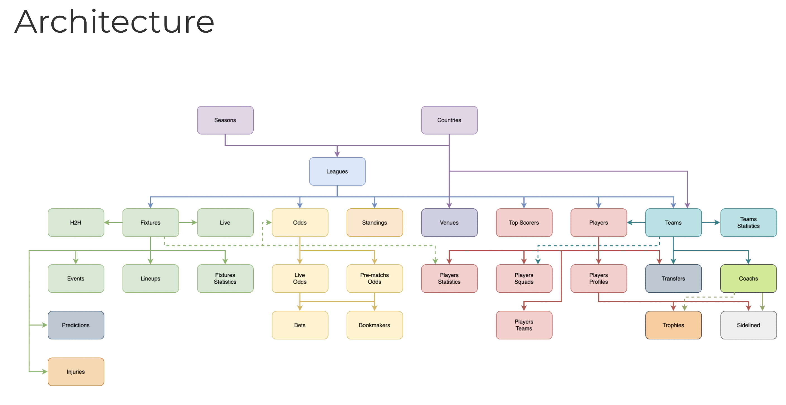

# Fenerbahce Analytics Project

This project collects, prepares, and analyzes Fenerbahce football data from API-Football.

The current dataset focuses on Turkish Super Lig fixtures, match events, and player match statistics for the 2022, 2023, and 2024 seasons.

## Project Goals

- Analyze Fenerbahce performance by season, opponent, venue, and match context.
- Study pressure matches such as derbies, final weeks, and title-race games.
- Compare player performance across matches and seasons.
- Prepare the data for SQL analysis.
- Later, compare Fenerbahce patterns with other clubs where useful.

## Current Data

Processed data lives in `data/processed/`.

- `fenerbahce_fixtures_2022.csv`
- `fenerbahce_fixtures_2023.csv`
- `fenerbahce_fixtures_2024.csv`
- `fenerbahce_fixtures_all.csv`
- `fenerbahce_player_stats_all.csv`

Raw API responses live in `data/raw/`.

- `data/raw/fenerbahce_fixtures_*.json`
- `data/raw/events/`
- `data/raw/player_stats/`

## Setup

Create a `.env` file in the project root:

```txt
API_FOOTBALL_KEY=your_real_api_key_here
```

Install dependencies:

```bash
pip install -r requirements.txt
```

## Script Order

Run the scripts in this order when rebuilding the dataset:

```bash
python get_fixtures.py
python parse_fixtures.py
python combine_fixtures.py
python get_fixture_players.py
python parse_fixture_players.py
python get_fixture_events.py
```

## Existing Analysis Questions

- Does Fenerbahce reduce player performance after players join the club?
- Does Fenerbahce perform well in easier emotional contexts but struggle in pressure matches?
- Does organizational instability correlate with title failure?
- Are there unusual officiating patterns compared with league averages?

Possible pressure-match indicators:

- Title-race weeks
- Final 8 matches
- Derby weeks
- Must-win matches

Possible organizational-instability indicators:

- Coach changes
- Formation changes
- Starting XI volatility
- Transfer turnover
- Captain changes

Possible officiating indicators:

- Penalties per match
- Opponent red cards per match
- Added-time patterns
- Foul-to-card conversion ratio

## Next Roadmap

1. Audit the data for missing fixtures, player stats, and event files.
2. Parse raw event JSON into a clean CSV table.
3. Create a SQLite database.
4. Load fixtures, player stats, and events into SQL tables.
5. Write SQL queries for the first football analysis questions.

## Architecture


